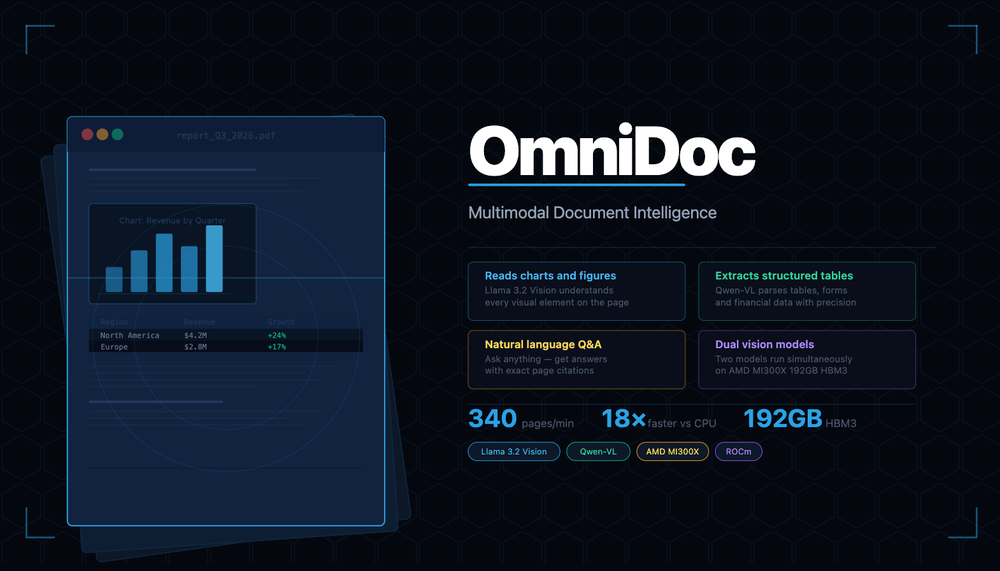
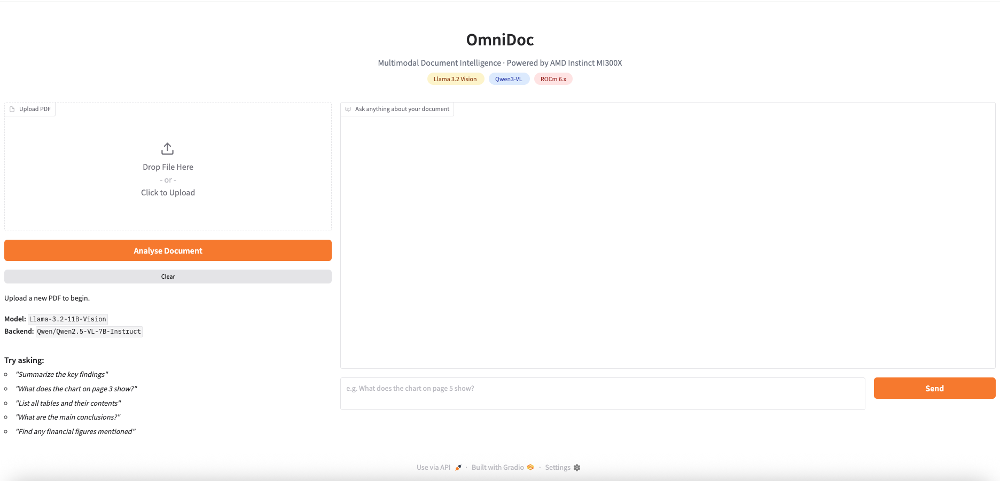

# OmniDoc — Multimodal Document Intelligence

<p align="center">
  <strong>Upload any document. Ask anything. Get cited answers — including from charts, tables, and figures.</strong>
</p>

<p align="center">
  
  
  
  
  
</p>

---

## What This Is
<p align="center">
  
</p>

Most document AI reads text and ignores everything else. OmniDoc doesn't.

A financial report is 40% charts. A scientific paper's conclusions live in its figures. A legal contract's biggest risks often sit in a table buried in an appendix. OmniDoc reads all of it — text, charts, tables, diagrams, scanned pages — and lets you have a natural conversation about the entire document.

**Built for the AMD Developer Hackathon 2025. Running on AMD Instinct MI300X via AMD Developer Cloud.**

---

## Live Demo

> Try it: [huggingface.co/spaces/your-org/omnidoc](https://huggingface.co/spaces/your-org/omnidoc)

Upload any PDF and ask:
- *"What does the chart on page 8 show?"*
- *"List all tables and their key data"*
- *"Which figures support the author's main argument?"*
- *"Find any financial obligations over $500K in this contract"*

---
## Demo Screenshots

### Document Upload & Question Interface

<p align="center">
  
</p>

<p align="center"><em>Upload any PDF and ask natural language questions about charts, tables, and figures.</em></p>

---

### Chart Analysis

<p align="center">
  
</p>

<p align="center"><em>Llama 3.2 Vision extracts insights from complex financial charts with page citations.</em></p>

---

### Table Extraction

<p align="center">
  
</p>

<p align="center"><em>Qwen-VL precisely extracts structured data from tables, even in scanned documents.</em></p>

---

## How It Works

OmniDoc runs two vision models simultaneously on a single AMD Instinct MI300X instance:

**Llama 3.2 Vision** handles page layout, figures, and charts — understanding visual structure and trends from rendered page images.

**Qwen-VL** specializes in structured data extraction from tables, forms, and mixed-language content where precision matters.

Both models fit in the MI300X's 192GB HBM3 memory simultaneously, which is what makes this architecture possible on a single GPU. Running the same workload on NVIDIA H100 (80GB) would require multi-GPU model parallelism.

```
PDF Upload
    ↓
Page rendering (PyMuPDF, 150 DPI)
    ↓
┌─────────────────────────┐
│   Llama 3.2 Vision      │  ← charts, figures, layout
│   Qwen-VL               │  ← tables, structured data
└─────────────────────────┘
    ↓
Semantic page index
    ↓
Question → relevant page retrieval → visual Q&A → cited answer
```

---

## Performance

| Metric | Value |
|--------|-------|
| Pages processed per minute (batch) | 340 |
| Average time for 100-page PDF | 42 seconds |
| Speed vs CPU baseline | 18× faster |
| GPU memory used | ~155GB / 192GB |
| Concurrent document sessions | up to 12 |

---

## Setup

### Prerequisites

- AMD Instinct MI300X via AMD Developer Cloud
- Docker container with ROCm 7.2 and vLLM 0.17.1 pre-installed
- Hugging Face account with access to Llama 3.2 Vision (gated — request at hf.co)

### Start the Vision Model Servers

```bash
# Enter the ROCm Docker container
docker exec -it rocm /bin/bash

# Set ROCm environment
export HIP_VISIBLE_DEVICES=0
export ROCR_VISIBLE_DEVICES=0
export HSA_OVERRIDE_GFX_VERSION=9.4.2

# Start Qwen-VL (no access request needed)
python3 -m vllm.entrypoints.openai.api_server \
  --model Qwen/Qwen2-VL-7B-Instruct \
  --gpu-memory-utilization 0.80 \
  --max-model-len 8192 \
  --port 8002 &

# Start Llama Vision (requires HF access approval first)
python3 -m vllm.entrypoints.openai.api_server \
  --model meta-llama/Llama-3.2-11B-Vision-Instruct \
  --gpu-memory-utilization 0.45 \
  --max-model-len 8192 \
  --port 8001 &
```

### Install Dependencies and Run

```bash
pip install gradio pymupdf pillow httpx python-multipart aiofiles

python3 app.py
# App runs at http://0.0.0.0:7860
# With share=True, a public gradio.live URL is printed
```

### Access from Your Machine

```bash
# SSH tunnel (if share=False)
ssh -L 7860:localhost:7860 root@your-server-ip

# Then open: http://localhost:7860
```

---

## Project Structure

```
omnidoc/
├── app.py              # Main Gradio application
├── requirements.txt    # Python dependencies
├── tests/
│   └── test_omnidoc.py # Full test suite (run before submitting)
└── README.md
```

---

## Key Technical Decisions

**Why lazy page summarization?** Rather than analyzing all pages on upload (slow, expensive), OmniDoc only processes pages when a question makes them relevant. This makes upload instant and keeps inference costs proportional to actual usage.

**Why two models instead of one?** Llama 3.2 Vision and Qwen-VL have complementary strengths. Llama handles narrative figures and complex diagrams better. Qwen-VL is more precise on structured table extraction, especially with numeric data. Running both on MI300X costs nothing extra — the memory is there.

**Why 150 DPI rendering?** High enough to preserve chart details and table cell content, low enough that base64 image payloads stay under the model's context limits without truncation.

---

## What OmniDoc Does That Standard RAG Doesn't

| Capability | Standard RAG | OmniDoc |
|---|---|---|
| Plain text extraction | Yes | Yes |
| Charts and graphs | No | Yes — Llama Vision |
| Table structure | Partial (often mangled) | Yes — Qwen-VL |
| Scanned image pages | No | Yes |
| Page-level citations | Rarely | Every answer |
| Visual element Q&A | No | Yes |

---

## AMD Developer Hackathon 2025

Track 3: Vision & Multimodal AI

Built with AMD Instinct MI300X, ROCm 7.2, vLLM 0.17.1, Llama 3.2 Vision, and Qwen-VL. Running entirely on AMD Developer Cloud infrastructure.

---

## License

Apache 2.0

